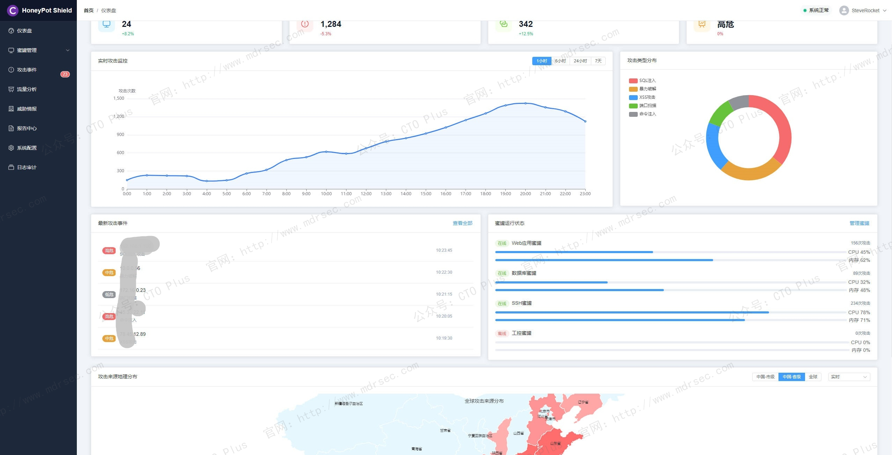
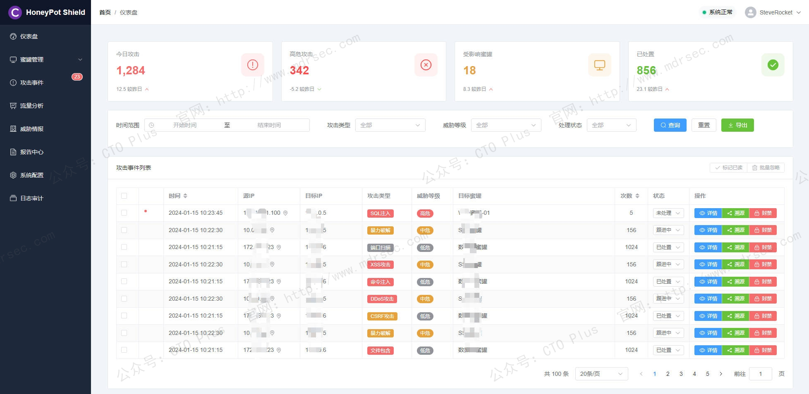
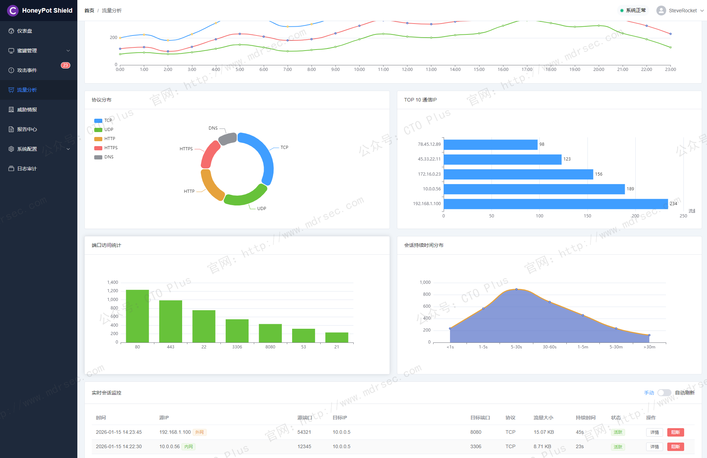
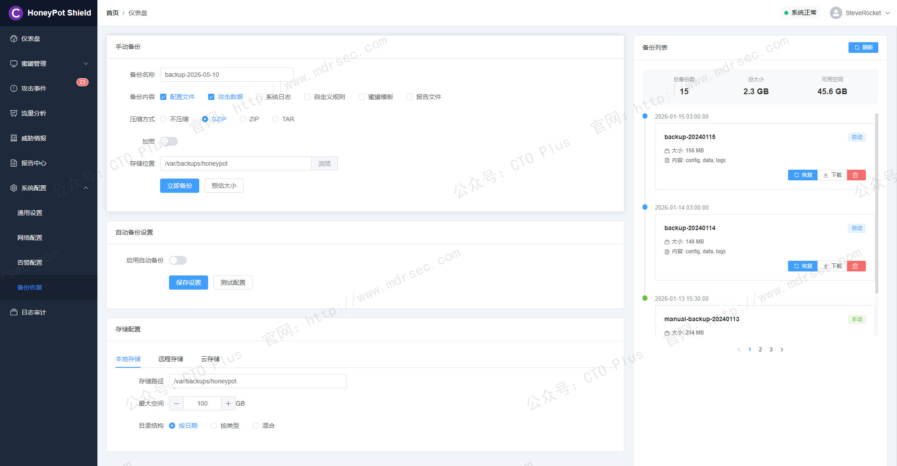
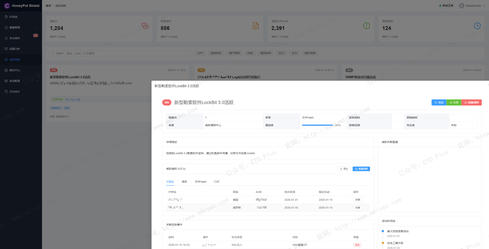

# 网络安全蜜罐管理系统（HoneyPot）

## 关于我们

- 官网： http://www.mdrsec.com

我们的技术文章和产品概述欢迎浏览我们的门户。

- 公众号：CTO Plus

最新的动态欢迎关注我们官方唯一公众号。

- 作者QQ

更详细更具体的需求，或者项目合作，或者问题 欢迎联系我。

- QQ群

我们官方组建的QQ群，如果您有兴趣也可以加入我们。

- 请喝咖啡

如果感兴趣，也可以请我喝杯咖啡

## 产品核心功能模块

## 一、背景

传统企业安全防御体系以防火墙、入侵检测系统、入侵防御系统和防病毒软件为核心，本质上是基于已知攻击特征库的被动防御模式。这种模式对于新型攻击、0day漏洞利用和高级持续性威胁往往无能为力——攻击者只需找到一处未被规则覆盖的缺口即可突破防线，防守方则始终处于“未知漏洞、未知手法、未知时间”的不利境地。

蜜罐技术的出现标志着防御思路的根本性转变。作为一种主动诱导型防御技术，蜜罐通过布置作为诱饵的主机、网络服务或信息，诱使攻击者对其实施攻击，从而捕获攻击行为、分析攻击工具与方法、推测攻击意图与动机。这一“请君入瓮”的诱导手段，使防守方得以将战场从真实资产转移到可控的仿真环境，化被动为主动 。

我们的企业级蜜罐管理系统正是在此理念基础上构建的工程化产品，将单点蜜罐提升为可集中管控、可横向扩展、可与现有安全体系联动的系统性平台。这里我将从架构设计、核心功能模块、关键技术特性三个维度，展开介绍下我们自研的蜜罐管理系统。

## 二、系统架构设计

### 2.1 B/S架构与组件分离

我们的企业级蜜罐系统采用B/S架构，由管理端、节点端和蜜罐服务三层组成。管理端负责生成和管理节点端，接收、分析和展示节点端回传的数据；节点端接受管理端的控制并负责构建蜜罐服务；蜜罐服务则直接承受攻击者的交互 。

这种架构设计的优势在于：

- **集中管控、分布部署**：管理员通过单一Web控制台即可管理分布于不同网络区域的蜜罐节点，实现策略统一下发、数据统一汇聚
- **弹性扩展**：节点端可按需增加，支持跨地域、跨网段的分布式部署，适应企业多分支、混合云等复杂网络环境
- **风险隔离**：管理端与节点端分离，即使蜜罐节点被攻破，攻击者也无法沿管理通道反向渗透至核心管理平台

### 2.2 旁路部署与网络无侵入

我们的企业级蜜罐系统通常采用旁路部署模式，不改变现有网络拓扑，不串联在业务流量路径中。这种设计确保了蜜罐系统的引入不会对业务连续性和网络性能产生影响 。通过端口重定向、流量牵引等技术手段，攻击流量被悄无声息地导入蜜网，正常业务流量则不受任何干扰。

### 2.3 蜜网构建与网络欺骗

单点蜜罐的迷惑性有限，我们通过构建完整的蜜网来提升欺骗深度。蜜网由多种类型的蜜罐节点组成，模拟企业真实的网络环境——包括Web服务器、数据库服务器、文件服务器、网络设备、IoT设备等，形成立体化的攻击面诱饵。通过虚拟化伪装技术和网络重定向技术，将攻击者的探测和攻击行为从真实资产诱导至蜜网环境 。

## 三、核心功能模块

### 3.1 多维度的蜜罐服务仿真能力

蜜罐的诱捕效果直接取决于仿真的逼真程度。我们的蜜罐系统支持覆盖企业常见业务场景的蜜罐类型：

**（1）网络服务类蜜罐**
模拟常见网络协议与服务，包括FTP、SSH、Telnet、RDP、VNC、SMTP等远程管理与邮件服务。此类蜜罐主要用于捕获暴力破解、凭证猜测等初始入侵行为，记录攻击者使用的弱口令字典和登录后执行的命令 。

**（2）数据库类蜜罐**
模拟MySQL、Redis、MongoDB、ElasticSearch、SQLServer等数据库服务。数据库往往是攻击者横向移动和数据窃取的核心目标，通过模拟这些服务可有效捕获攻击者的数据操作行为，甚至获取其植入的恶意代码 。

**（3）Web应用类蜜罐**
模拟OA系统、CRM系统、NAS存储系统、运维平台、邮件系统等企业常见Web应用。这类蜜罐技术含量较高，需模拟登录页面、业务流程、数据交互甚至特定漏洞（如Log4j漏洞），以诱使攻击者发起更深层次的交互 。

**（4）行业专用类蜜罐**
模拟工控系统、视频监控系统、网络设备管理界面、IoT设备等垂直行业场景。例如模拟海康威视摄像头登录界面、H3C/Huawei交换机管理页面等，针对特定行业攻击者进行精准诱捕 。

**（5）自定义蜜罐与蜜饵**
同时，还支持用户自定义Web蜜罐和蜜饵配置。蜜饵是放置在真实资产上的诱饵文件（如伪装的密码文件、配置文件、Word文档等），当攻击者访问或下载这些文件时触发告警，实现从真实资产侧的反向感知 。

### 3.2 攻击捕获与全链条行为记录

与传统安全设备仅记录告警日志不同，我们的蜜罐系统对攻击行为的记录是“全链条”的——从攻击者的首次探测，到漏洞利用，再到登录后的每一个命令、每一次文件操作，均被完整记录。

具体而言，攻击捕获能力包括：

**（1）交互级行为记录**
不同于防火墙和IDS的“请求-响应”快照式记录，蜜罐可记录攻击者在蜜罐环境中的完整操作序列。例如在SSH蜜罐中，可记录攻击者登录后执行的每一条命令、下载的文件、修改的配置；在Web蜜罐中，可记录攻击者浏览的页面路径、提交的表单数据、上传的文件等 。

**（2）攻击工具指纹识别**
通过分析攻击者使用的扫描器特征、漏洞利用工具特征、User-Agent、键盘敲击节奏等，识别攻击者所使用的自动化工具类型和版本，进而关联已知攻击组织的TTP（战术、技术、程序）特征 。

**（3）恶意软件捕获**
当攻击者在蜜罐环境中下载或植入恶意软件时，蜜罐系统可自动捕获样本文件，并可联动沙箱进行动态行为分析，判定文件恶意属性，提取C2通信地址等威胁情报 。

**（4）全端口扫描感知**
除已开放模拟服务的端口外，企业级蜜罐系统还应具备全端口扫描识别能力。当攻击者对蜜罐节点发起全端口扫描时，即使目标端口未开放服务，系统也能感知扫描行为并记录扫描源IP、扫描范围和扫描频次 。

### 3.3 攻击溯源与攻击者画像

溯源能力是我们蜜罐系统的核心价值之一——它不仅告诉用户“有人来攻击”，更要回答“是谁在攻击、从哪来、攻击能力如何”等问题。

**（1）攻击者身份溯源**
通过获取攻击者的设备指纹、浏览器指纹、社交信息（如通过JSONP跨域获取的社交账号）、位置信息等，构建攻击者的多维身份画像。同时，蜜罐系统可获取攻击者的自然人身份信息，为后续法律取证提供依据 。

**（2）攻击路径还原**
基于攻击时序和行为链条，还原攻击者的完整攻击路径：从初始访问方式（漏洞利用/弱口令/钓鱼），到权限提升手段，再到横向移动尝试和数据渗出行为。这一能力帮助防御方理解自身网络的薄弱环节 。

**（3）反向探测与反制**
在法律法规允许范围内，我们的蜜罐系统支持对攻击者实施有限度的反制措施。例如通过浏览器漏洞或社交工程获取攻击者主机的更多信息，或向攻击者浏览器植入标记用于后续跟踪。此类功能需谨慎使用，严格遵循合法合规边界 。

### 3.4 威胁情报生产与共享

蜜罐因其“任何访问即为可疑”的特性，是天然的威胁情报生产探针。

**（1）私有情报生产**
蜜罐捕获的攻击源IP、攻击工具Hash、攻击手法特征、恶意域名/IP等数据，经清洗和验证后可沉淀为企业私有威胁情报库。这些情报可直接应用于防火墙、IDS/IPS、WAF等防护设备的策略联动，实现“一点捕获、全网阻断” 。

**（2）外部情报集成**
我们的企业级蜜罐系统支持对接第三方威胁情报平台（如微步在线X社区、360威胁情报中心等），自动查询攻击源IP的情报信誉，辅助判定攻击者威胁等级和所属组织背景 。

**（3）情报共享机制**
通过STIX/TAXII等标准协议，我们的蜜罐系统可将脱敏后的攻击数据共享至行业ISAC（信息共享与分析中心）或上级监管平台，参与构建更广泛的威胁情报生态 。

### 3.5 告警与联动处置

**（1）多渠道告警通知**
我们的企业级蜜罐系统支持邮件、Syslog、WebHook、企业微信、钉钉、飞书等多种告警输出方式，确保安全团队在第一时间获得攻击告警。告警内容应包含攻击时间、攻击源IP、攻击目标服务、攻击行为摘要等关键信息 。

**（2）安全设备联动阻断**
蜜罐系统通过API接口与防火墙、入侵防御系统、态势感知平台等安全设备联动。当蜜罐确认攻击源后，可自动向防火墙下发阻断策略，对攻击IP进行实时封禁。联动方式包括手动封禁（永久）、自动封禁（可配置封禁时长）和白名单豁免等 。

**（3）SOAR集成**
同时，在我们自研的SOAR系统中，蜜罐作为SOAR（安全编排自动化与响应）的触发器，当检测到特定类型攻击时，自动触发预设的响应剧本——如隔离受影响网段、阻断攻击源、创建工单、通知责任人等，实现闭环处置 。

### 3.6 可视化态势大屏

我们的系统提供面向不同角色的可视化能力。态势大屏以地图、热力图、趋势图等形式实时展示攻击来源分布、攻击类型TOP5、攻击趋势曲线、失陷主机状态等宏观指标，帮助管理层快速掌握整体安全态势 。

对于一线安全分析师，则提供详细的攻击日志检索、攻击链图形化展示、原始数据包下载等功能，支持深度分析和取证。

### 3.7 白名单与策略管理

为降低误报和运维噪音，我们的蜜罐系统支持灵活的白名单策略：

- **IP白名单**：将内部漏洞扫描器、监控系统、合规测试设备等合法探测源加入白名单，其访问行为不触发告警
- **端口白名单**：将业务正常调用的端口排除在监控范围之外
- **时间窗口策略**：支持在特定时间段（如红蓝对抗演练期间）调整告警策略的敏感度

## 四、关键技术特性

### 4.1 交互级别的欺骗深度

我们的蜜罐按交互深度可分为低交互、中交互和高交互三类：

- **低交互蜜罐**：仅模拟协议握手和基础响应，不提供真实服务环境。部署简单、风险低，但易被识别
- **中交互蜜罐**：模拟完整的服务交互流程，提供有限度的命令执行和文件操作能力，在欺骗深度和安全性之间取得平衡
- **高交互蜜罐**：使用真实的操作系统和应用环境，攻击者可获得完整的Shell权限。欺骗性最强但风险也最高，需严格的隔离和控制措施

企业级蜜罐系统通常以中交互为主，辅以可控的高交互环境，在保证欺骗效果的同时控制风险 。

### 4.2 欺骗防御的隐匿性保障

蜜罐系统自身的隐蔽性同样关键。若攻击者能轻易识别蜜罐环境，诱捕效果将大打折扣。隐匿性保障包括：

- **指纹伪装**：隐藏或修改蜜罐软件的典型特征（如特定HTTP响应头、默认页面Hash、服务Banner等）
- **流量仿真**：模拟真实业务的流量模式，避免因“过于安静”而被识破
- **时间行为模拟**：模拟真实系统的定时任务、用户活动周期等时间维度的行为特征

### 4.3 自身安全与风险隔离

蜜罐本质上是“故意暴露漏洞”的系统，若安全隔离不当，可能成为攻击者渗透内网的跳板。我们的企业级蜜罐具备：

- **网络隔离**：蜜罐节点部署在独立网段或VPC，通过防火墙严格控制东西向流量，防止攻击者从蜜罐横向移动至真实资产
- **流量单向控制**：仅允许攻击流量进入蜜网，严格限制蜜网向外主动发起连接
- **管理通道加密**：管理端与节点端的通信采用TLS加密，防止管理指令被窃听或篡改

### 4.4 跨平台与国产化适配

我们面向政企市场的蜜罐系统具备广泛的平台兼容性。主流产品支持Linux（x32/x64/ARM）、Windows（x32/x64）平台，并适配国产操作系统（麒麟、统信UOS等）和国产CPU（龙芯、飞腾、鲲鹏、海光、兆芯等） 。Docker容器化部署方式进一步降低了环境依赖和部署复杂度。

### 4.5 极低的性能要求

作为旁路部署的诱捕系统，蜜罐对硬件资源的消耗极低。节点端仅需维持模拟服务的端口监听和简单交互响应，单台低配服务器或虚拟机即可支撑数十个蜜罐服务实例。这一特性使得我们的蜜罐可以广泛部署于接入层交换机下游、分支机构边缘节点等资源受限环境 。

## 五、典型应用场景

### 5.1 内网失陷检测

在内网部署蜜罐节点，模拟数据库、文件服务器、运维平台等高价值目标。当攻击者突破边界进入内网进行横向移动时，其扫描和攻击行为将触发蜜罐告警。由于内网环境中正常访问蜜罐的概率极低，任何触碰均可视为失陷征兆，实现高信噪比的威胁发现 。

### 5.2 攻防演练

在HVV等攻防演练场景中，蜜罐扮演着“影子防线”的角色。通过在真实资产周边布设蜜罐，诱导攻击队将时间和火力消耗在仿真环境上，为防守方争取响应时间。同时，蜜罐记录的攻击行为可作为溯源得分的直接证据 。

### 5.3 0day与未知威胁捕获

蜜罐的检测逻辑不依赖已知特征库，所有进入蜜罐的访问均为异常行为。这一特性使其天然具备对0day漏洞利用、APT攻击、新型恶意软件等未知威胁的捕获能力——即使攻击者使用从未披露的漏洞和手法，只要进入蜜网就会被记录 。

### 5.4 等保合规支撑

等保2.0标准明确要求“应能够识别、监控虚拟机之间的网络流量”以及具备对新型攻击的分析能力。我们的蜜罐系统通过部署于VPC内的探针感知东西向流量威胁，可满足等保对云环境安全区域边界的技术要求 。

## 最后

我们的蜜罐管理系统工具正慢慢成长为成熟的安全产品品类。其核心价值在于：以攻击者视角重构防御逻辑，将“不知道攻击何时来、从哪来”的被动局面扭转为“预设战场、主动诱敌”的主动防御态势。

同时，我们的蜜罐管理系统在三个维度达到较高水准：**欺骗深度**——蜜罐仿真的逼真程度决定诱捕效果的下限；**分析广度**——对攻击行为的全链条记录与溯源能力决定情报价值的上限；**联动能力**——与现有安全体系的集成深度决定防御闭环的完整度。

随着云原生架构的普及和攻击手法的持续演进，蜜罐技术也在向云蜜罐、容器化蜜网、智能化欺骗策略等方向演进。对于企业而言，蜜罐不再是可有可无的补充工具，而是构建纵深防御体系的关键一环。

## 产品清单

### 企业网络安全运营中心产品

- 资产安全配置管理系统（SCMDB）
- 终端侦测与响应系统（EDR）
- 网络侦测与响应系统（NDR）
- 企业网络资产攻击面管理系统（CAASM）
- 资产暴露面管理系统（AEMS）
- 网络安全蜜罐管理系统（HoneyPot）
- 安全事件收集与告警管理系统（SIEM）
- 扩展侦测与响应系统（XDR）
- 多引擎脆弱性扫描系统（VAS）
- 多源日志审计监测系统（LAS）
- 网络安全威胁情报中心（TIS）
- 网络安全漏洞库管理系统（VDBS）
- 网络安全编排与自动化响应（SOAR）
- 威胁狩猎系统（THS）
- 数据库安全审计系统（DSAS）
- AI智能体安全态势管理系统（AISPM）
- Web防火墙（WAF）
- 网站安全监测平台（WSM）
- 网络安全态势感知平台（SSAP）
- 网络安全自动化应急响应工具系统（NSRT）
- 企业网络安全运维工具系统（SecTools）
- 网络安全自动化等保测评系统（ASES）
- 浏览器安全监测防护系统（BSMPS）
- 网络安全用户实体行为分析系统（UEBA）
- 互联网电信诈骗预警防护系统（TPFWS）
- 云原生安全管理平台（CNAPP）
- 自动化渗透测试系统（PTS）
- 工业企业信息安全监测中心（IoT SOC）
- 企业智能安全运营中心（AISOC）

### 企业自动化运维产品

- 运维智能监控告警管理平台（AIMAMS）
- 企业网络工具系统（NTools）
- 自动化测试系统（AutoTest）
- 自动化运维系统（AutoOps）
- 企业运维工具系统（OpsTools）
- 物联网管理系统（IoTS）
- 软件开发生命周期管理系统（SDLC）
- IT流程管理系统（ITSM）

### 企业数字化运营资源管理系统产品

- 制造执行管理系统（MES）
- 运输管理系统（TMS）
- 跨境电商企业资源管理系统（ERP）
- 企业客户关系管理系统（CRM）
- 跨境电商仓库管理系统（WMS）
- 财务管理系统（FMS）
- 质量管理系统（QMS）
- 精准营销管理系统（PMS）
- 智能生产管理系统（SPMS）
- 电商BI系统（BI）
- 智能互联网分布式爬虫系统（AISpider）

## ABOUT

**【关于我们】**

* [主页：http://116.205.137.183/index_pro.html](http://116.205.137.183/index_pro.html)
* [Articulate v1.0](https://mp.weixin.qq.com/s/0yqGBPbOI6QxHqK17WxU8Q)
* [Articulate v2.0](https://mp.weixin.qq.com/s/V5Axn-ZWi22ubh5Jiocb9g)

 🥰

**【代码工程系列】**

* [Python和Go的设计模式](https://github.com/zrf-rocket/DesignPattern)
    * GitHub：https://github.com/zrf-rocket/DesignPattern
    * Gitee：https://gitee.com/SteveRocket/design_pattern

* [Python、Go的编码技巧cookbook](https://github.com/zrf-rocket/CookBook)
    * GitHub：https://github.com/zrf-rocket/CookBook
    * Gitee：https://gitee.com/SteveRocket/cook-book

* [Go代码示例](https://github.com/zrf-rocket/PracticeGo)
    * GitHub：https://github.com/zrf-rocket/PracticeGo
    * Gitee：https://gitee.com/SteveRocket/practice_go

* [Python代码示例](https://github.com/zrf-rocket/PracticePython)
    * GitHub：https://github.com/zrf-rocket/PracticePython
    * Gitee：https://gitee.com/SteveRocket/practice_python

* [Python Web框架的示例代码](https://github.com/zrf-rocket/PythonFramework)
    * GitHub：https://github.com/zrf-rocket/PythonFramework
    * Gitee：https://gitee.com/SteveRocket/python_framework

* [Rust代码示例](https://github.com/zrf-rocket/PracticeRust)
    * GitHub：https://github.com/zrf-rocket/PracticeRust
    * Gitee：https://gitee.com/SteveRocket/practice_rust

* [Vue代码示例](https://github.com/zrf-rocket/PracticeVue)
    * GitHub：https://github.com/zrf-rocket/PracticeVue
    * Gitee：https://gitee.com/SteveRocket/practice_vue

* [前端代码示例](https://github.com/zrf-rocket/PracticeFronted)
    * GitHub：https://github.com/zrf-rocket/PracticeFronted
    * Gitee：https://gitee.com/SteveRocket/practice_fronted

* [Python自动化测试框架](https://github.com/zrf-rocket/PythonTestAutomationFramework)
    * GitHub：https://github.com/zrf-rocket/PythonTestAutomationFramework
    * Gitee：https://gitee.com/SteveRocket/python_test_automation_framework

* [Python和Go的算法代码示例](https://github.com/zrf-rocket/Algorithms)
    * GitHub：https://github.com/zrf-rocket/Algorithms
    * Gitee：https://gitee.com/SteveRocket/Algorithms

* [Python和Go的数据结构代码示例](https://github.com/zrf-rocket/DataStructure)
    * GitHub：https://github.com/zrf-rocket/DataStructure
    * Gitee：https://gitee.com/SteveRocket/data_structure

* [编码规范](https://github.com/zrf-rocket/DevGuide)
    * GitHub：https://github.com/zrf-rocket/DevGuide
    * Gitee：https://gitee.com/SteveRocket/develop_guide

* [编码安全规范](https://github.com/zrf-rocket/SecGuide)
    * GitHub：https://github.com/zrf-rocket/SecGuide
    * Gitee：https://gitee.com/SteveRocket/security_guide

**【产品系列】**

* [主机监控系统-日志收集与报警管理系统（SIEM）](https://github.com/zrf-rocket/SIEM)
    * GitHub：https://github.com/zrf-rocket/SIEM
    * Gitee：https://gitee.com/SteveRocket/siem

* [安全运营中心（SOC）-终端侦测与响应系统（EDR）](https://github.com/zrf-rocket/EDR_SOC)
    * GitHub：https://github.com/zrf-rocket/EDR_SOC
    * Gitee：https://gitee.com/SteveRocket/edr_soc

* [DevSecOps-SDLC](https://github.com/zrf-rocket/DevSecOps-SDLC)
    * GitHub：https://github.com/zrf-rocket/DevSecOps-SDLC
    * Gitee：https://gitee.com/SteveRocket/dev-sec-ops-sdlc

* [AI图像识别-智能缺陷检测系统]()
    * [基于AI图像识别的工业缺陷检测应用系统（GPU&FPGA）](https://mp.weixin.qq.com/s/04qefQFg-Pg1Gcqq1vBLQQ)
    * [基于AI图像识别的智能缺陷检测系统，在钢铁行业的应用-技术方案](https://mp.weixin.qq.com/s/dSHbnuOwQZzE4CvPr1JYjg)

# 安全运营中心（SOC）-终端侦测与响应系统（EDR） 

